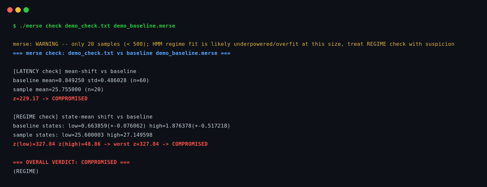

# Merse

Boundary detector. Old English *merse*: a march, a boundary — the line
between clean and compromised.

Merse detects timing-based tampering that alters the path. It does
not detect compromised keys, passive decryption, or quantum threats.

Detects whether a monitored channel has drifted from an established
clean baseline. Domain-agnostic: operates on plain numeric series
(one value per line). Capturing the raw data (tcpdump, ping, etc.) and
any preprocessing (jitter, RTT, returns) is the caller's job, not this
tool's.

## Build

```
gcc -O3 -Wall -o merse merse.c -lm
```

## Example

Real output, a tampered sample checked against a clean baseline
(sample/baseline names genericized, no identifying data):



## Usage

```
merse baseline <values_file> <baseline_out_file>
merse check    <values_file> <baseline_file>
```

`baseline` records a clean reference: overall mean/std, plus a 2-state
Gaussian HMM fit (state means/std, Baum-Welch/EM).

`check` scores a new sample against that baseline on two independent
checks and reports the worse of the two:

- **LATENCY check** — sample mean vs baseline mean, z-test scaled by
  baseline std and sample size.
- **REGIME check** — fresh HMM state means vs baseline state means,
  scaled by baseline state std.

Verdict thresholds: `|z| < 2` CLEAN, `2 <= |z| < 5` SUSPECT, `|z| >= 5`
COMPROMISED.

## Validated against

Adversarial test, 2026-09-06, on a live WireGuard tunnel via `tc
netem` — full writeup with real numbers in `CASE_STUDY.md`, including
a correction found on a later audit.

- **Random jitter injected** (variable delay): both checks caught it
  hard (LATENCY z=199.5, REGIME z=9.1).
- **Fixed 25ms delay injected** (deterministic relay/inserted hop):
  REGIME check is structurally blind to this (a uniform delay doesn't
  change inter-sample spacing) — but LATENCY check, run against the
  same jitter series, still caught it (z=22.6) once measured against a
  correctly matched baseline. An RTT series gives an even cleaner
  signal (z=76.4, near-exact match to the injected delay).

**Operational conclusion: REGIME and LATENCY are sensitive to
orthogonal tampering signatures, and RTT is a cleaner LATENCY signal
than jitter-mean when available. Run all three where possible, and
always baseline from the same vantage point you'll be checking from.**

## Known limitations / out of scope

- **Protocol/session-layer attacks are invisible to this tool.** Merse
  only sees timing statistics from outside the tunnel. A
  capture-replay hijack or any attack that compromises the
  cryptographic/protocol layer directly (e.g. bypassing WireGuard's
  own replay protection) has no guaranteed timing signature — if the
  attacker's relay path introduces no measurable delay/jitter change,
  Merse will not detect it. This class of attack must be caught at the
  protocol layer itself (nonce/counter validation), not by external
  timing analysis.
- **A degenerate baseline (near-zero variance) cannot produce a
  reliable z-score.** Handled by design: `check` reports INDETERMINATE
  rather than CLEAN in this case, and the overall verdict floors at
  SUSPECT. Fixed 2026-09-06 after review — an earlier version silently
  returned z=0 (reads as CLEAN) on this edge case, a fail-open logic
  bug that would have let an attacker's deviation score identically to
  no deviation at all if the baseline happened to be too quiet or too
  short.
- **Fewer than 500 samples: REGIME check flagged as unreliable.**
  Warned, not blocked — a 2-state HMM fit on a short window is prone
  to overfitting noise as if it were a real regime (found empirically
  during development: a 224-sample window scored *worse* than its own
  shuffle-null, the signature of overfitting, not "no regime"). The
  LATENCY check doesn't need as much data and isn't covered by this
  warning.
- **A malformed input file fails loudly, not silently.** `fscanf`
  stops at the first non-numeric token; without an explicit check that
  silently truncates the read. Merse now refuses and exits nonzero
  instead of scoring a partial capture as if it were complete.
- **Not a market/trading tool.** The regime-switching methodology was
  cross-validated on crypto volatility data during development, but
  that was proof-of-generality, not a product direction. Merse is a
  tamper/anomaly detector, not a signal generator.

## License

Source-available, free for personal/non-commercial use. Commercial
use requires a separate license — see `LICENSE`.
